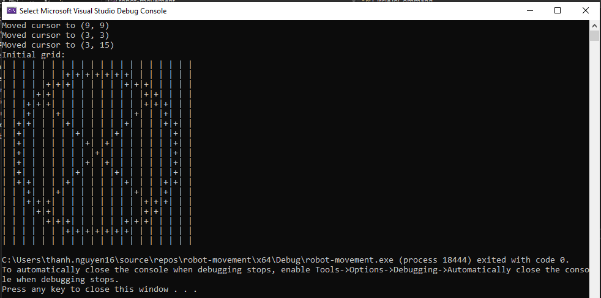

### **Main Components**
1. **`Grid` Class**:
   - Manages the NxN grid for drawing.
   - Main functions:
     - Create a grid with a custom size.
     - Mark cells on the grid.
     - Draw and display the grid's state.

2. **`Command` Class**:
   - The base class for all commands.
   - Uses inheritance to extend additional commands.

3. **`MoveToCommand`**:
   - Command to move the cursor to the position `(x, y)` without drawing.
   - Changes the robot's current position.

4. **`LineToCommand`**:
   - Command to draw a straight line from the current position to `(x, y)`.

5. **`CircleToCommand`**:
   - Command to draw a circle with radius `r`, centered at the robot's current position.
   - Uses a lookup table for trigonometry to optimize performance.

6. **`robot-movement.cpp`**:
   - The entry point of the program.
   - Processes input, converts commands, and calls the corresponding methods for execution.

---

### **Customization Guide**
- To add a new command:
  1. Create the corresponding class for the new command in `command.hpp`.
  2. Inherit from the `Command` class and define the `execute()` method.
- To change the marking symbol, modify the `Grid` class.
- To adjust the grid size or command execution process, modify the `commandsForTesting.txt` file

### **Test Results**

